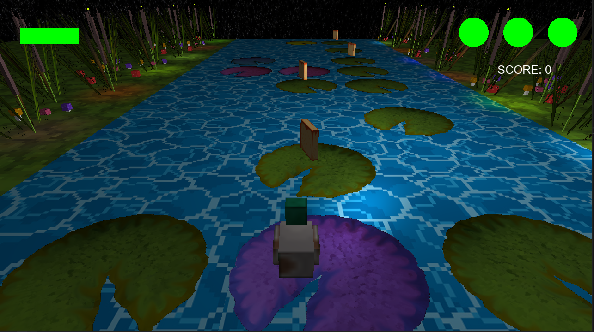

# DuckRunner

This application is a 3D platformer developed in OpenGL.

The game features a determined duck on a starry night, that strives to collect as many bread slices as possible, while jumping on lilypads and avoiding obstacles. 

**Notes**
* The main code of the application is located in "Sources/Laboratoare/Tema2"
* During this university project, I learned how to create and work with 3D meshes, design objects, apply textures, work with the 3D camera and apply lighting to objects. 
